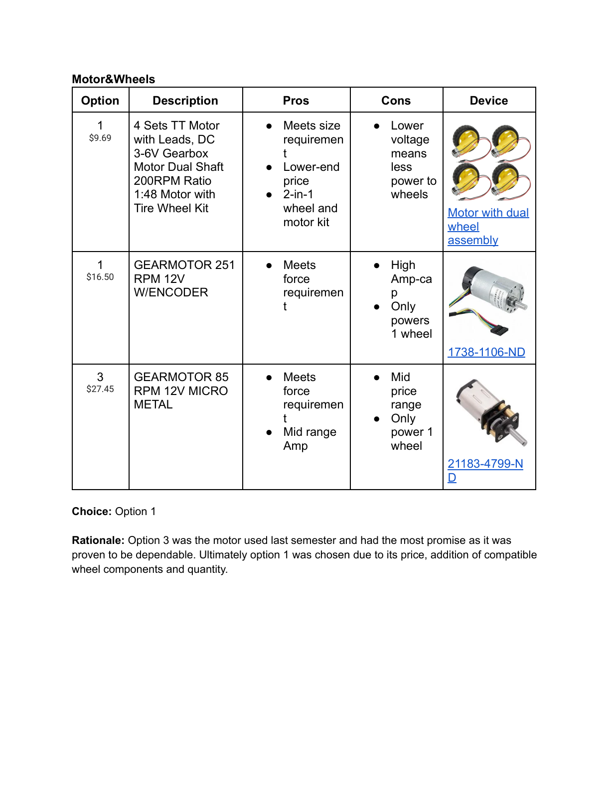
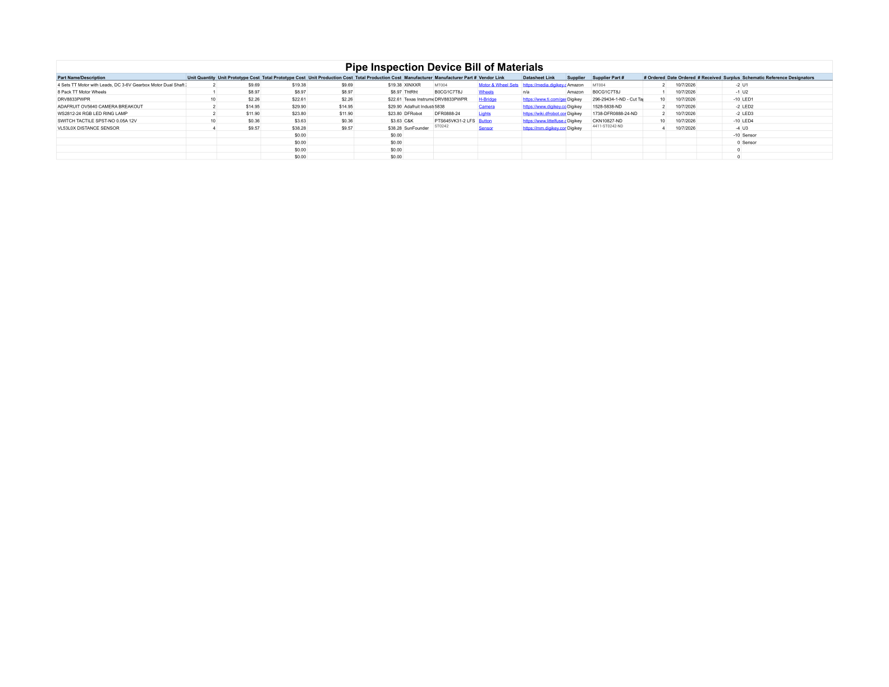

## Component Selection

This decision matrix shows the tradeoffs we evaluated when selecting the motor and wheel combination for the project.

*Click the image to open the full PDF.*

The selected option was the most cost-effective solution that still satisfied the required torque and wheel compatibility constraints. This made it the strongest balance of performance, availability, and manufacturability for the prototype.

[Open the full PDF](../static/314-component-selection.pdf)

## Bill of Materials

The bill of materials summarizes the selected parts and their quantities for the design.

*Click the image to open the full PDF.*

[Open the full PDF](../static/bill-of-materials.pdf)